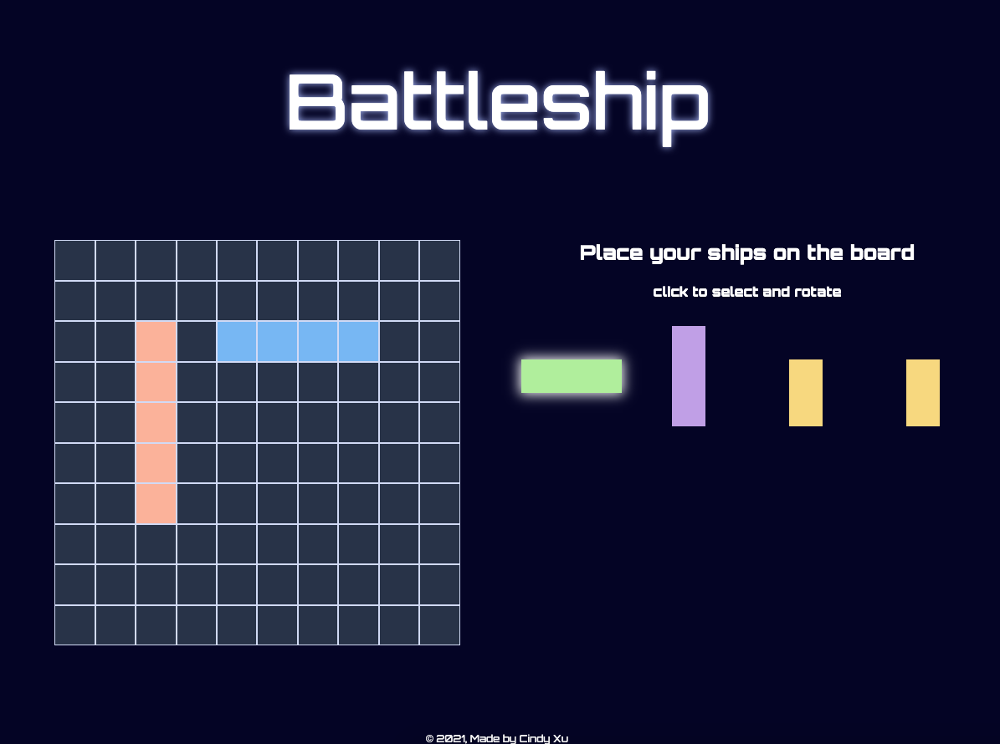
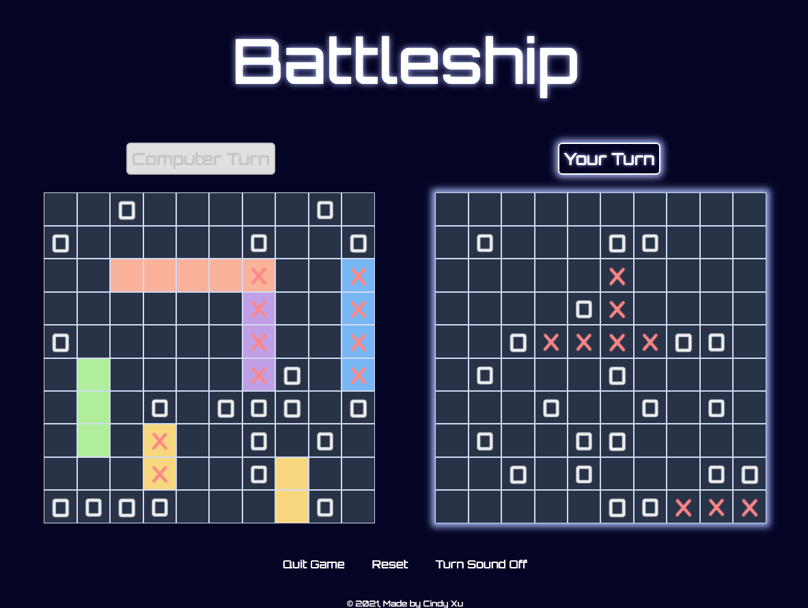

# Battleship
A classic battleship game against a computer AI. First one to hit all of the oponent's ships wins!

**Features:**
* Desktop and Mobile compatible
* Ships can be selected, rotated, previewed on grid, and placed
* AI Algorithm that mimics human guess patterns
* Grid lights up to indicate player turn
* Options to toggle sound effects, restart game with current ship placements, and return to starting page.

## Screenshots
-----
 

## Languages Used
-----
* HTML
* CSS
* JavaScript

## Get Started
---
[**Play it here!**](https://c1ndyy.github.io/Battleship/)

## Next Steps
---
* Add drag and drop for mobile
* Improve AI attacks to target grid areas of low density
* Add more sound effects and animations
* Add a two player option across two different devices